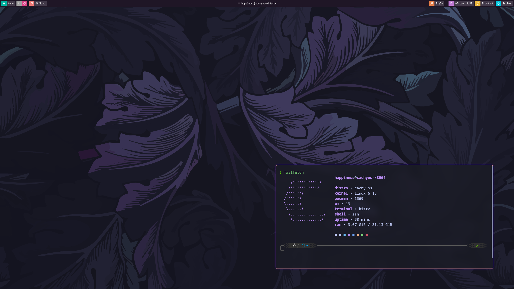

# i3wm-dots
Purple &amp; Pink i3wm Rice for CachyOS.




---

**distro** Cachy Os (Arch based)

**wm**: i3wm + autotiling

**bar**: Polybar (blocks)

**comp**: Picom by ftlabs

**terminal**: Kitty

**tools**: CAVA, Btop


1. Install all dependencies, open your terminal and run this command to install everything you need (i3, polybar, picom, kitty, and tools):
   ```bash
   sudo pacman -S polybar kitty btop cava fastfetch unzip rofi flameshot feh ttf-jetbrains-mono-nerd

   yay -S picom-ftlabs-git

2. Clone and extract repository
   ```bash
   git clone https://github.com/happin92/i3wm-dots

   cd i3wm-dots

   unzip config.zip -d ~/.config/

3. Reboot i3
   ```bash
   i3-msg reload

4. Enjoy using!
